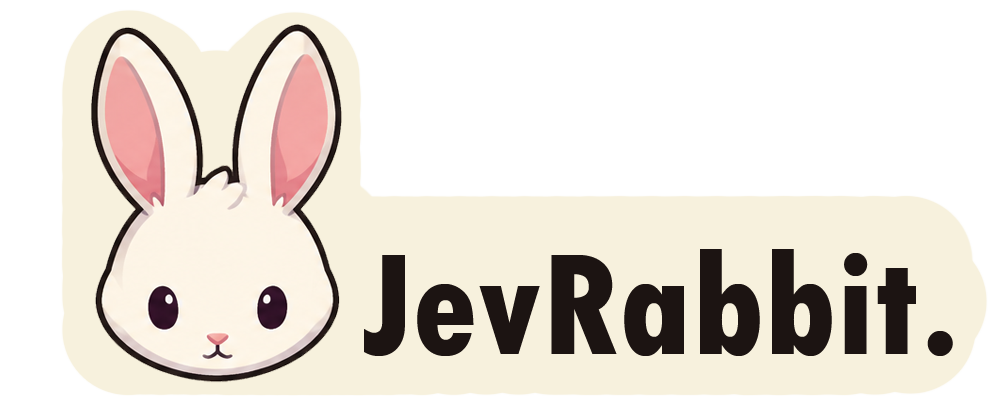
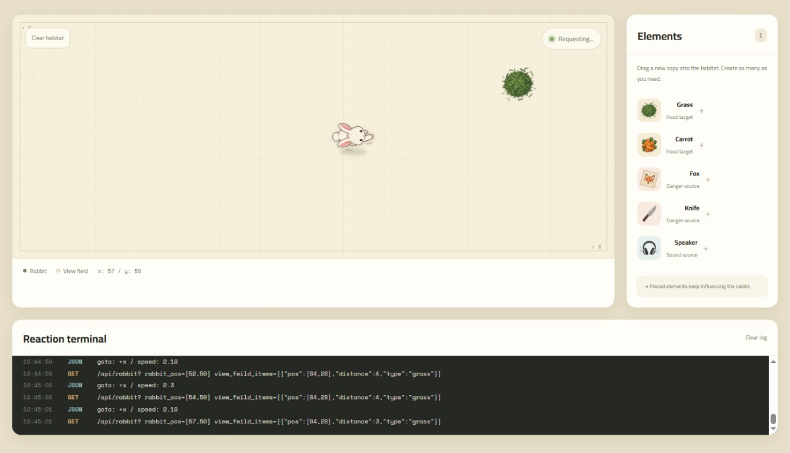

<p align="center">


<br><br>


</p>

# 

Jev Rabbit is a small interactive rabbit behavior simulator. Add food, danger, and sound sources to the habitat and watch how the rabbit reacts.

It is powered by the new JevAI, which is designed as a System 1 AI for fast, intuitive decisions.

## Features

- Drag or click to add grass, carrots, foxes, knives, and speakers.
- Watch the rabbit move around the 2D habitat.
- View requests and reactions in the terminal log.
- Use the local preview when the API is not available.

## Screenshot

<!-- Add a screenshot of the application here -->


## Run Locally

1. Install the Python packages:

	```bash
	pip install flask requests
	```

2. Set your OpenRouter API key:

	```bash
	set OPENROUTER_KEY=your_api_key
	```

3. Start the app:

	```bash
	python main.py
	```

4. Open `http://localhost:5000` in your browser.

## Project Files

- `index.html` - Application layout
- `style.css` - Visual styles
- `app.js` - Interaction and rabbit movement
- `main.py` - Flask API and AI decision requests
